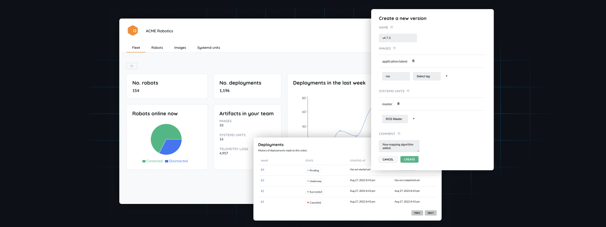

    
    

<h3 align="center">Airbotics is an open-source DevOps platform for robotics.</h3>

 

    
    
    
    
    
    
    
    
    
 

 

We're building a product for Software Over The Air (SOTA) deployment designed for robots. You can use our hosted version at <a href="https://airbotics.io" target="_blank">airbotics.io</a> or self-host it on your own infrastructure.

⚠️ We're still in Alpha so this should not be considered stable or secure. ⚠️

 

## Contents

- [Features](#features)
- [Project status](#project-status)
- [Community](#community)
- [Contributing](#contributing)
- [Security](#security)
- [License](#license)
- [Credits](#credits)

## Features

#### 1. Multiple computers per robot

A robot typically doesn't have just one computer that needs to be updated - they often have a main board, maybe a separate GPU board, and a several satellite microcontrollers - each of which may need to be updated together, to maintain API compatibility, or separately if one changes more frequently than others.

We're building our system so every computer on a robot can natively accept, verify and install updates and report on their status.

#### 2. Pull-based

Computers in robots can have poor network connections, limited bandwidth, unreliable power, or spend much of their time controlling the robot - something that shouldn't be interrupted.

It's inenvitable that some robots in a fleet won't be in a state to accept an update when one is pushed out, requring retry logic to avoid failed deployments and time spent debugging.

With Airbotics, you can create application-specific business logic on your robots that decide when an update should be initiated (e.g. in a charging dock, have good network, have shut down other processes, have notified fleet manager, etc.), and then make a [ROS](https://www.ros.org/) action call to our agent to begin an update cycle, which we report back on.

#### 3. Security

Software supply chains are increasingly being targeted by attackers. We're building on top of the <a href="https://uptane.github.io/" target="_blank">Uptane</a> framework - the *de facto* standard for OTA in automative sector designed to be compromise-resilient. Uptane is an extension of [The Update Framework](https://theupdateframework.com/) - a framework for securing software update systems used by Docker Content Trust, PyPI, Datadog and more.

With Airbotics you can assign signing authority to multiple members of your team (e.g Head of QA, Head of Ops, Director of Engineering, etc.), a quorom of which are required to sign a release using their private offline keys in order for it to be considered ready to be deployed to your fleet. 

#### 4. Multi-player

It takes a village to run a robot fleet, and lots of people need to be involved in the software release process:
- An account manager may want to request a group of robots be updated to a new version, requiring approval from other teammates,
- A QA engineer may need to sign off on a release as fit for deployment,
- Security teams may need to know which robots are affected by an outdated vulnerable release and put out a patch,
- Support teams may need to know which release is deployed to a robot that customers are reporting problems with,
- Sales and marketing teams may need to know what is the breakdown of robots on `v1.1` over `v1.0`, given that the subscription for `v1.1` has increased in price,
- And on and on...

We're building a dashboard that anyone on the team can use - without requiring coding skills - to get the information and take the actions they need without having to ping the dev team.

#### 5. Press pause

Robots can have seasonal usage - argicultural robots tend be busy around harvest time, lawnmowing robots tend to be busy during summer months, and intralogistics robots tend be busy around Black Friday. After that, robots may be unused for a period of time.

Airbotics allows you to decommission a robot for a period of time without having to re-provision it with our agent. When it's decommissioned, a robot will still be authenticated and connected to our backend, but won't be able to accept updates - robots that are decommissioned won't be charged.

#### 6. Plus more

Along with these, we're building the usual features you would expect from a OTA system - gradual / canary rollouts, integrations with your favourite tools, grouping of robots, team management, audit trails, and so on.

## Project status

- [x] On the launchpad (public alpha) - moving fast and breaking things, should not be considered stable.

- [ ] Leaving the atmosphere (public beta) - stable enough for most use cases, may still contain bugs.

- [ ] Orbit (general availability) - ready for scale and production use cases.

## Community

- [Discord](https://discord.gg/W2TR4WXUqv) - for hanging out with people building and using Airbotics.

- [GitHub Issues](https://github.com/Airbotics/airbotics/issues) - for bugs and feature requests.

- [Twitter](https://twitter.com/Airboticsio) - for updates and announcements.

- [Email](mailto:hello@airbotics.io) - for contacting the maintainers directly.

## Contributing

Please see our [contributing guide](CONTRIBUTING.md) for information.

## Security

Please see our [security policy](SECURITY.md) for information.

## License

The software in this project is licensed under [Affero GPL v3](LICENSE).

## Credits

Airbotics was inspired by the following works, we're standing on the shoulders of these giants:

- [OTA Community Edition](https://github.com/advancedtelematic/ota-community-edition).

- [Reference implementation of TUF](https://github.com/theupdateframework/python-tuf).

- [Obsolete reference implementation of Uptane](https://github.com/uptane/obsolete-reference-implementation).
